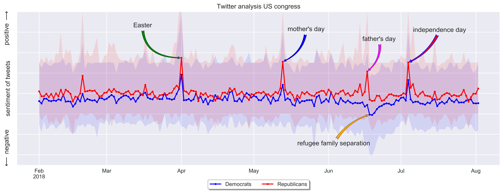

# Data processing examples
this repository aims to show examples of data processing using python. 
These examples are used in the python course developed at www.mamba-python.nl (Dutch).

#### Twitter analysis US Congres

A  [jupyter notebook](congress_twitter_analysis/congress_twitter_analysis.ipynb) with an analysis of twitter data from US congress members.
The sentiment of the tweets from US congress members is automatically analysed. 
The results are shown in a plot with the daily average sentiment for the republican and democratic party. 
Outliers are analysed and annotations are added with the cause of the outlier.

the following sources are used for this analysis:
- twitter text data from https://github.com/alexlitel/congresstweets
- twitter user data from https://github.com/alexlitel/congresstweets-automator
- polarity analysis tool from https://github.com/sloria/textblob

<figure>
   
</figure>