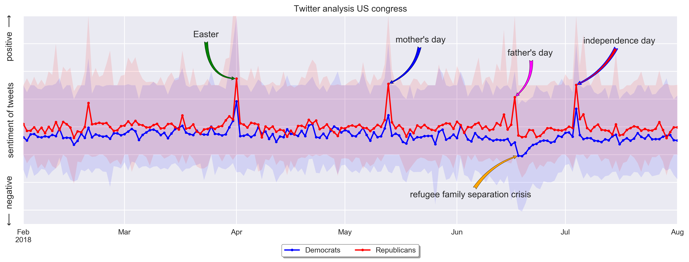

# Data processing examples
this repository aims to show examples of data processing using python. 
These examples are used in the python course developed for www.mamba-python.nl (Dutch).

#### Twitter analysis US Congres

A  [jupyter notebook](congress_twitter_analysis/congress_twitter_analysis.ipynb) with an analysis of twitter data from US congress members.
The sentiment of the tweets from US congress members is automatically analysed. 
The results are shown in a plot with the daily average sentiment for the republican and democratic party. 
Outliers are analysed and annotations are added with the cause of the outlier.

<figure>
	
</figure>

the following sources are used for this analysis:
- twitter text data from https://github.com/alexlitel/congresstweets
- twitter user data from https://github.com/alexlitel/congresstweets-automator
- polarity analysis tool from https://github.com/sloria/textblob

<figure>
   
</figure>

#### Whatsapp data analysis

A  [jupyter notebook](/whatsapp&#32;data/whatsapp_data_analysis.ipynb) with the analysis of a whatsapp conversation.
The data was obtained by exporting a single Whatsapp chat (see https://faq.whatsapp.com/en/android/23756533/).
I did not add this chat to this repository because of privacy issues. 
I did create an anonymised pandas dataframe that you can read to reproduce my results. 
I left the original reading code so you can read you own results.

<figure>
   
</figure>